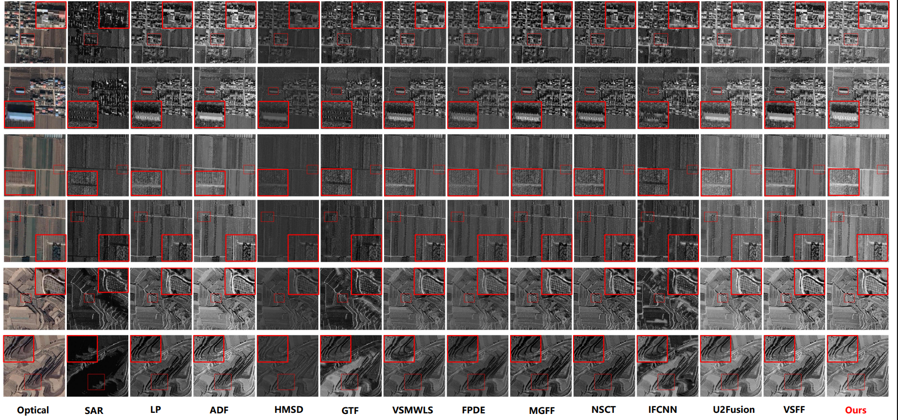
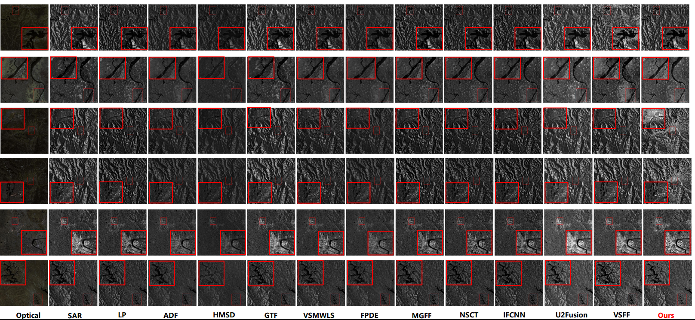

**New**  
2026.06.21  Our work has been accepted by the IEEE Journal of Selected Topics in Applied Earth Observations and Remote Sensing.     

**Note:**   

2025.06.18  We propose a   SAR and optical image fusion method and experimentally demonstrate the robustness of our method.

The manuscript has been submitted to *IEEE Journal of Selected Topics in Applied Earth Observations and Remote Sensing*.    
title: *Progressive Multistage Fusion of SAR and Optical Image Method : From Feature-Level Preservation to Pixel-Wise Refinement*    


**Results:** 

---
<center>

</center>


<center>

</center>


---

**References** 

``` 
@ARTICLE{11577164,
  author={Liu, Chenhua and Li, Hao and Li, Maoyong and Deng, Lei and Dong, Mingli and Zhu, Lianqing},
  journal={IEEE Journal of Selected Topics in Applied Earth Observations and Remote Sensing}, 
  title={Progressive Multistage Fusion of SAR and Optical Image Method : From Feature-Level Preservation to Pixel-Wise Refinement}, 
  year={2026},
  volume={},
  number={},
  pages={1-20},
  doi={10.1109/JSTARS.2026.3706337}}

``` 
