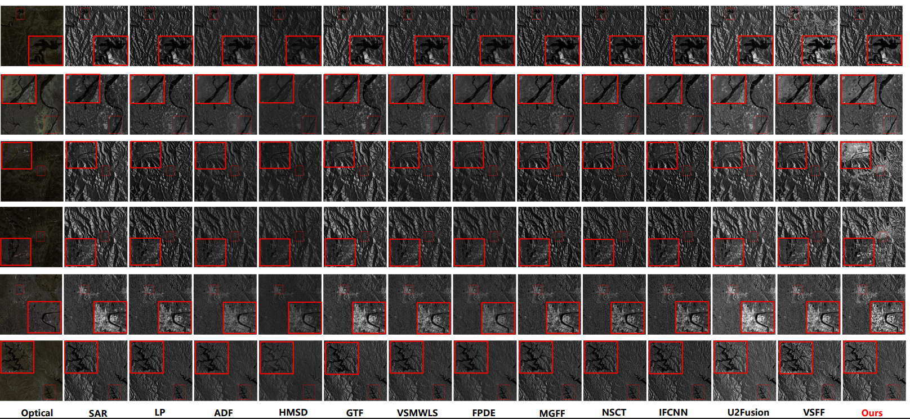

# SAR图像融合项目 / SAR Image Fusion Project

## 项目简介 / Project Introduction

这是一个基于MATLAB的SAR（合成孔径雷达）图像融合项目，用于将SAR图像和光学图像进行融合处理。
This is a MATLAB-based SAR (Synthetic Aperture Radar) image fusion project for fusing SAR and optical images.

**Note:**

We propose a multi-stage SAR and optical image fusion method and experimentally demonstrate the robustness of our method.

The manuscript has been submitted to *IEEE Journal of Selected Topics in Applied Earth Observations and Remote Sensing*. All codes will be released after the manuscript is accepted.

## 项目结构 / Project Structure

```
sar_fusion/
├── mainSar.m                 # 主程序文件 / Main program file
├── Function/                 # 函数库文件夹 / Function library folder
│   ├── preprocessing/        # 预处理模块 / Preprocessing module
│   │   ├── prfusionPress.m   # 预融合处理 / Pre-fusion processing
│   │   ├── shrink.m          # 图像尺寸调整 / Image size adjustment
│   │   └── Bregman.m         # Bregman方法去噪 / Bregman denoising
│   ├── decomposition/        # 分解模块 / Decomposition module
│   │   └── SSF.m             # 结构特征分解 / Structure feature decomposition
│   ├── fusion/               # 融合模块 / Fusion module
│   │   └── single_scale.m    # 单尺度融合 / Single-scale fusion
│   ├── weighting/            # 权重计算模块 / Weighting module
│   │   ├── weight_spd.m      # 权重计算 / Weight calculation
│   │   └── mean_fun.m        # 均值函数 / Mean function
│   └── utilities/            # 工具模块 / Utilities module
│       └── boxfilter.m       # 盒式滤波器 / Box filter
├── fusedir/                  # 融合结果输出文件夹 / Fusion results output folder
├── Prefusedir/               # 预融合结果文件夹 / Pre-fusion results folder
└── README.md                 # 项目说明文档 / Project documentation
```

## 函数依赖关系 / Function Dependencies

### 主程序调用关系 / Main Program Call Relationship
```
mainSar.m
├── prfusionPress() [预处理 / Preprocessing]
│   ├── shrink() [图像调整 / Image adjustment]
│   └── Bregman() [去噪 / Denoising]
├── SSF() [结构分解 / Structure decomposition]
└── single_scale() [融合 / Fusion]
    ├── boxfilter() [滤波 / Filtering]
    └── weight_spd() [权重计算 / Weight calculation]
        ├── boxfilter() [滤波 / Filtering]
        └── mean_fun() [均值计算 / Mean calculation]
```

## 模块说明 / Module Description

### 预处理模块 (Preprocessing Module)
- **prfusionPress.m**: 实现SAR和光学图像的预融合处理 / Implements pre-fusion processing for SAR and optical images
- **shrink.m**: 处理图像尺寸调整，使其符合算法要求 / Handles image size adjustment to meet algorithm requirements
- **Bregman.m**: 基于Bregman方法的总变分去噪算法 / Total variation denoising algorithm based on Bregman method

### 分解模块 (Decomposition Module)
- **SSF.m**: 结构特征分解算法，将图像分解为纹理层和细节层 / Structure feature decomposition algorithm that decomposes images into texture and detail layers

### 融合模块 (Fusion Module)
- **single_scale.m**: 单尺度图像融合算法，实现多源图像的融合 / Single-scale image fusion algorithm for multi-source image fusion

### 权重计算模块 (Weighting Module)
- **weight_spd.m**: 计算图像融合权重 / Calculates image fusion weights
- **mean_fun.m**: 均值计算函数 / Mean calculation function

### 工具模块 (Utilities Module)
- **boxfilter.m**: 高效的盒式滤波器实现 / Efficient box filter implementation

## 使用方法 / Usage Instructions

1. 确保MATLAB环境已安装 / Ensure MATLAB environment is installed
2. 运行主程序 / Run the main program:
   ```matlab
   mainSar
   ```
3. 融合结果将保存在 `fusedir/` 文件夹中 / Fusion results will be saved in the `fusedir/` folder

## 参数设置 / Parameter Settings

- `ParaSet`: 平衡参数，控制图像对比度保真度和梯度平衡，默认值为100 / Balance parameter controlling image contrast fidelity and gradient balance, default value is 100
- `r`: 局部窗口半径，用于权重计算，默认值为15 / Local window radius for weight calculation, default value is 15

## 输出文件 / Output Files

程序会生成以下输出 / The program generates the following outputs:
- 预融合图像 / Pre-fusion images: `Prefusedir/1.bmp` 等 / `Prefusedir/1.bmp` etc.
- 最终融合图像 / Final fused images: `fusedir/1.bmp` 等 / `fusedir/1.bmp` etc.


**Results:** 

---
<center>

</center>


<center>

</center>


---
